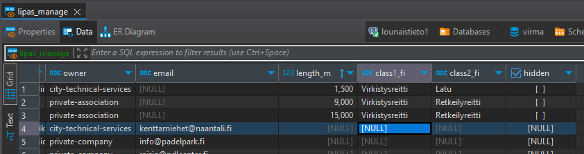

# Käyttöohjeet

# Korkealla tasolla

 - Automaation kopioi lippaan tiedot ja poistaa vanhat
 - virma näyttää lippaan tiedot
 - ylläpitäjä hyväksyy uudet pisteet/reitit lippaasta käsin
 - Yllpitäjä korjaa/asettaa luokkametatietoja tarvittaessa 

# Mitä tapahtuu taustalla

Joka yö lipas-integraatio lataa tietokantaan uusimmat päivitykset. 
Samalla se katsoo tietokannasta, olisiko mahdollisia uusia arvauksia jo olemassaolevien kategorisointien perusteella, ja lisää nämä arvaukset tietokantaan nille joissa näitä tietoja ei vielä ole.

# Ylläpitäjälle
 - Uusille kohteille tulee asettaa `class1_fi` ja `class2_fi`-tieto ja asettaa `hidden=false` jos kohteen/reitin haluaa näkyviin. Tämän voi tehdä `lipas_manage`-taulussa (tai suoraan `lipas_annotations`-taulussa):

 - Muita tietoja ei voi muuttaa!

# Tiedot eivät päivity heti
Aja seuraava komento tai odota tunti `REFRESH MATERIALIZED VIEW CONCURRENTLY routes_combined; REFRESH MATERIALIZED VIEW CONCURRENTLY points_combined;`
